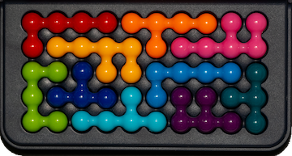
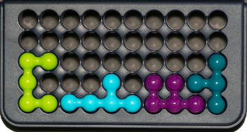

# IQ-FIT Game

## Game Description

The game involves implementing in Java, a board game called [IQ-Fit](https://www.smartgames.eu/uk/one-player-games/iq-fit)
made by the games developer [SmartGames](https://www.smartgames.eu/uk).

#### Objective 

The game is a puzzle.   The object of the game is to place ten plastic pieces on a board so that the pieces
fill the board perfectly, with no overlaps and no gaps. The player starts by selecting a
[challenge](#challenges) which will have some number of pieces already placed.  Their task is to place all 
remaining pieces.  Broadly, the more pieces that are placed, the smaller the set of remaining options for
the player, and therefore the easier it is to complete the puzzle.   The challenge is made interesting by
the complex three-dimensional shapes of the plastic pieces.

A completed game:

To help you visualize the game, we have provided a
[paper](assets/papergame.pdf) version, which you can cut out.

#### Challenges

A game starts by choosing a challenge which specifies in what positions certain
puzzle pieces must be placed. The puzzle pieces that are pre-placed by the challenge
at the start of the game cannot be moved by the player until the game is ended.

Here is the starting challenge for the game above:

In the challenge above, the _lime_ (L), _sky blue_ (S), _indigo_ (I), and _green_ (G) pieces 
are placed as part of the challenge.   They can't be moved.   You can see that much of the 
board is unfilled (grey holes).  The player's task is to place the
remaining six pieces in such a way that all of the board is covered perfectly, which means no 
gaps and no overlaps.

The game comes with five difficulty levels: _starter_, _junior_, _expert_, _master_, and _wizard_,
and offers 24 challenges at each level, for a total of 120 prescribed challenges.
These challenges are provided for you in the Solutions class.

#### Solutions

Each challenge has just one solution.

The following sequence shows one possible progression of a solution to the game
above (note that the order in which the pieces are played is not important; this
is just one possible sequence of moves).

#### Board

The game is played on a board comprised of 50 **locations** arranged
in a 10x5 grid.  

In the real-world game, each location consists of a
circular indent into which a piece may fit.  We refer to the placement of
pieces in terms of their upper left corner when a bounding box is placed around them.
In our game, locations are
encoded as two digits, the first one identifying the column from `0`
to `9`, followed by another identifying the row from `0` to `4`.

In the example illustrated below we show how the location of pieces on the board
is encoded.   Notice that we identify each piece by the location of the upper-left
corner of its _bounding box_ (a rectangular box drawn around the piece).

For example, in the game above, the _lime_ piece (lower-left, lime-green in color) is
in position `02` (column `0`, row `2`), the _sky-blue_ piece (bottom center-left) is
in position `23` (column `2`, row `3`), the _indigo_ piece (purple, bottom center-right)
is in position `63` (column `6`, row `3`), and the _green_ piece (green, right) is in
position `82` (column `8`, row `2`).  Notice how the bounding box is necessary
to identify the location of the _sky-blue_ piece since the piece itself does not cover
location `23`, but that is the top left corner of its bounding box.   Likewise for the
_green_ piece, which does  not cover `82`, but that is the top left corner of its bounding box.
For the _lime-green_ and _indigo_ pieces the top-left corner of the piece is the
same as the top-left corner of its bounding box.

#### Pieces

The game comprises **10 playing shapes**, each of a distinct color (_blue_, _green_,
_indigo_, _lime-green_, _navy-blue_, _orange_, _pink_, _red_, _sky-blue_, and _yellow_).

Each piece is **3-dimensional**.  Note that in your assignment, your game will be on a screen (just like this
description), so will only view each piece from a two-dimensional perspective.

You should study the picture below carefully.  The _lime-green_, _navy-blue_, and _red_
pieces have not been placed, revealing their three dimensional shape.

Each piece can be thought of in terms of a **spine** comprising either _three_ (_green_,
_indigo_, _lime-green_, _navy_) or _four_ (_blue_, _orange_, _pink_, _red_, _sky-blue_,
and _yellow_) spheres in a straight line.   

Each piece has three additional spheres that **protrude** from the spine, two in one plane, and one in the other.
Thus, when laid flat on a table and viewed from above, they will either have a **single protrusion**
 sticking out from the spine (_blue_ and _red_ in the photo), or a **double protrusion** (_lime-green_).  You
  can see these clearly in the diagram below. 

When a piece is placed on the board, it must be placed with either the single or double
protrusion pointing _downwards_ into
the holes in the board.   Thus in the photo above, each of the 7 pieces placed on the board
has no protrusions pointing upwards.   When a player places a piece, they can have either the
_double protrusion_ pointing down, into the board, or the _single protrusion_ pointing down into 
the board.  In the photo above, the _pink_, _orange_, and _sky-blue_ pieces each have their
_single protrusion_ visible, which means they were all placed with the _double protrusion_ pointing 
 downwards, into the
board.   On the other hand, the _blue_, _green_, _indigo_ and _yellow_ pieces all
have their _double protrusion_ visible, which means they have been placed with their
_single protrusion_ pointing downwards into the board.

Since each piece may be placed in one of four 90-degree _rotations_ (_north_, _east_, _south_, _west_),
and in two _flips_ (_single protrusion_ visible or _double protrusion_ visible), each piece has eight possible ways it can be placed on the board.

The diagram below illustrates all ten pieces and their eight possible orientations.  The first four
columns show each piece its _single_ protrusion visible with four 90-degree rotations, while the last four columns 
show each piece with its _double_ protrusion visible with four 90-degree rotations.  When we encode pieces in 
this assignment, we use lower case letters (e.g. `b`) to encode a piece in its 
_single protrusion_ orientation (left half of the diagram), and we use upper case letters
(e.g. `B` to encode a piece its _double protrusion_ orientation (right half of the diagram).

In the game below, you can see that _lime_ was placed in the `L` flip (double protrusion) and the `W` 
orientation (west), _sky-blue_ was placed in the `s` flip (single protrusion) and `S` orientation 
(south), etc.

#### Legal Piece Placements

For a piece placement to be valid, the following must be true:

* All of the visible spheres in the piece must be placed above board locations
 (**no part of a piece may be off the board**).
* All of the visible spheres in the piece must be placed on vacant board
  locations (**pieces may not overlap**).

# JAVA-IQ-Fit-Game
